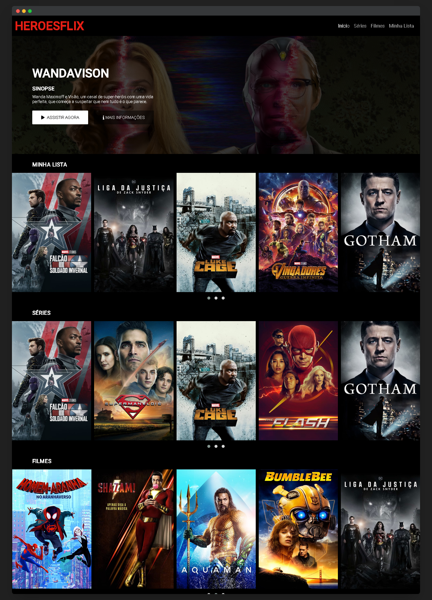

# Página Inicial da Netflix

## Contact Me
  

## Sobre

Projeto desenvolvido durante o Bootcamp HTML Web Developer oferecido pela DIO (Digital Innovation One) e com o professor <a href="https://github.com/felipeAguiarCode">Felipe Aguiar</a> com o intuito de colocar em prática tudo aquilo que foi lecionado nas aulas anteriores enquanto novos conceitos eram apresentados em uma aula voltada a teoria.

## Resultado Final

## Tecnologias

- HTML
- CSS
- JAVASCRIPT
- JQUERY